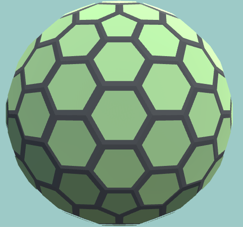
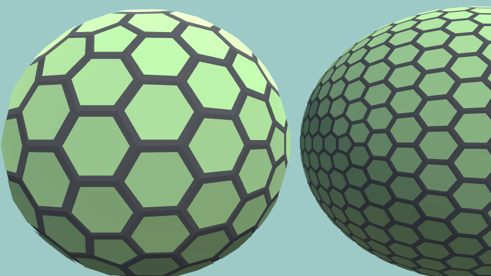

# Hexasphere-unity
<<<<<<< Updated upstream
=======
Generate a sphere covered mostly in hexagons in unity at runtime

Recommended to keep subdivisions under 4, for better performance

Original project: https://github.com/arscan/hexasphere.js
>>>>>>> Stashed changes
